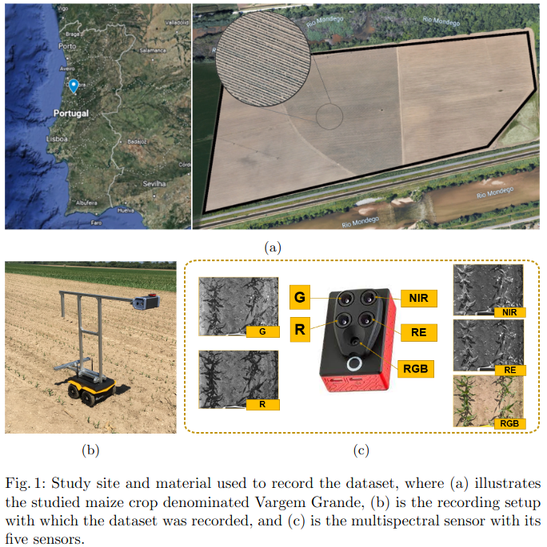

# Multispectral Image Segmentation in Agriculture: A Comprehensive Study on Fusion Approaches

The official repository of the paper. The code, checkpoint and training procedure will be release upon acceptance.

## Vargem Grande Dataset

To get the dataset, please send an e-email to tiagobarros@isr.uc.pt

 